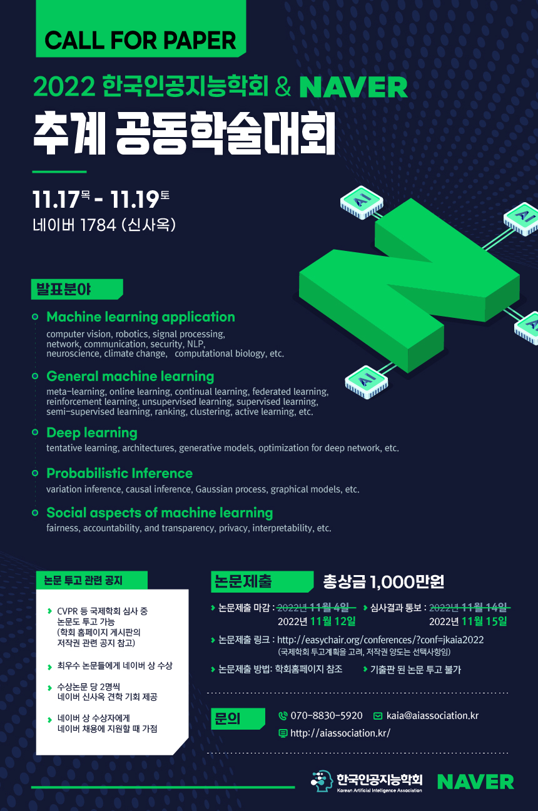

*Overview: 한국인공지능 학회 첫 참가*

그 동안 학회는 KSIAM만 참가해오다가 인공지능 학회도 참가하고 싶어서 가보았다.
먼저 분당의 네이버 사옥에서 학회가 진행되었는데, 네이버 건물과 내부가 세련되고 멋있었고 지하 주차장도 아마 8층까지 있었다.
이때 졸업하고 네이버에 정말 취직하고 싶다는 생각을 했었다. 
본론으로 들어가자면, 대학원생으로서 인공지능 학회는 처음이었는데 너무 기대가 되었다. 내가 관심있는 주제들을 많이 다루기 때문이었다.
GNN, Self-Supervised Learning, Diffusion, NLP 등 많은 발표를 들었고 모든 분야를 공부해보고 싶었다. 근데 몸은 하나고 내가 해야 할 일은 많고...
그래도 꾸준히 시간이 나면 개인적으로 따로 공부할 생각이다.
다음 학회도 기회가 되면 꼭 참석하고 싶다!
