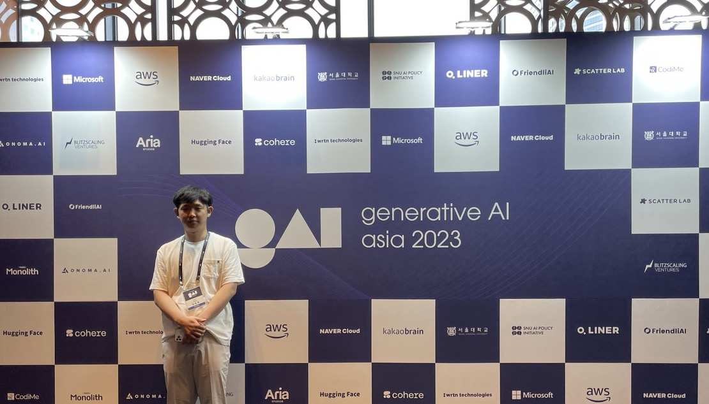

*Overview: GAA 2023 Conference 참가*  

인공지능 대학원생 톡방을 보던 중 GAA 2023 컨퍼런스가 열린다는 소식을 봤다. 네이버의 성낙호 이사님, 카카오 브레인의 김일두 대표님 등 굉장히 유명하신 분들이 오신다는 것을 보고 꼭 참가해야겠다..! 생각했다.
근데 참가비가 얼리버드를 적용하고도 약 20만 원이었다. 조금 부담이 되어서 지도교수님에게 연구비 지원을 조심스럽게 부탁드렸더니 감사하게도 흔쾌히 수락하셨다. 교수님 감사합니다!!!
어쨌든 갔다. 꽤 좋은 곳에서 진행했었고 규모도 굉장히 컸다. 설렜다. 일단 결론부터 말하자면, AI를 공부한 이후 바뀌지 않았던 나의 관점을 바꾸게 한 컨퍼런스였다. 그리고 재미있었다.
그동안 세미나, 컨퍼런스, 학회 같은 행사에 참여를 할 때 주로 이론적으로 많이 배울 목적과 인사이트를 넓힐 목적으로 참가를 했었다. 그런데 이론적인 강연을 하지 않았던 행사들은 대체로 재미가 없었다.
그저 백그라운드 설명하고 실험 결과 설명하고 "우리 메소드 좋아요!"에 그칠 뿐이었다. 그러나 이번 컨퍼런스는 이론적인 내용이 하나도 없었는데 불구하고 굉장히 재미가 있었다. 
일단, 나는 Generative AI는 딱히 큰 관심을 가지지 않았다. 그 이유라면, 악용될 위험 즉, 윤리적인 문제와 상용화의 가능성이 없었다는 점이 크게 작용했다.
근데 이러한 나의 생각은 ChatGPT 등장 이후로 조금씩 바뀌었다. 전부터 이러한 AI가 등장할 줄은 알고 있었지만 이렇게나 빨리 세상에 나오고 사람들에게 널리 알려지게 될 줄은 몰랐다.
이번 컨퍼런스에서 발표를 듣다가 "AI의 1세대는 분류와 탐지가 메인이라면 2세대는 생성이 메인이다."라는 말을 듣고 나서 머리가 띵했다. 사실 내재적으로는 알고 있었겠지만 이걸 직접 육성으로 들으니 조금 충격이었다.
AI가 트렌드에 굉장히 민감한 분야이긴 하지만 "AI가 완전히 Generative로 트렌드를 바꿨구나."라는 생각이 들면서 Generative AI를 공부해야겠다고 생각했다.
Large Language Model을 fine-tuning하는 방법을 미리 공부해두고 관련 methods의 페이퍼를 읽어놔야 할 것 같다.
이번 컨퍼런스를 가지 않았다면 Generative AI에 대한 나의 생각은 크게 변하지 않았을 것이다. 많은 생각을 하게 되었고 굉장히 유익했던 컨퍼런스였다. 다음에도 또 컨퍼런스가 열릴 기회가 있다면 꼭 참가하고 싶다.
