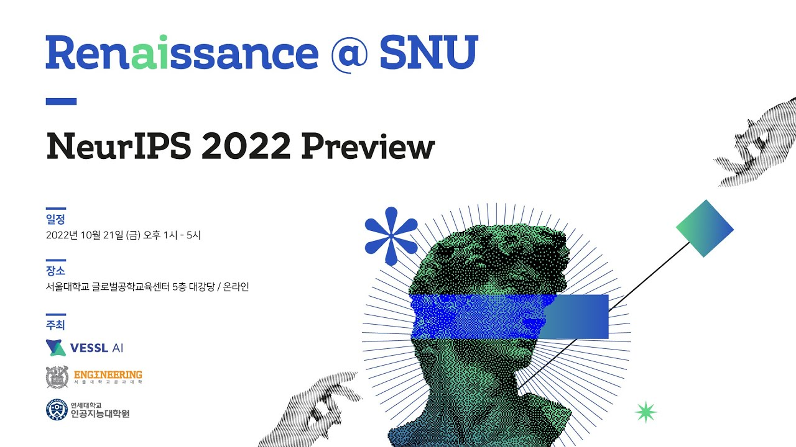

*Overview: 서울대학교에서 진행한 NeurIPS 2022 Preview 컨퍼런스에 참가했습니다.*

NeurIPS 2022 학회에 accepted 된 paper의 저자분들을 초청한 Preview 컨퍼런스에 참가했습니다.
일단 살짝 초짜같은 발언을 조금 하자면, 서울대학교에 처음 가봤는데 캠퍼스가 진짜 컸다... 대한민국에서 제일 캠퍼스 크기가 크다고 말만 들었지 실제로 본 적은 없었다...
나는 당시 자차로 네비게이션 찍고 운전해서 가느라 다행이었지 만약 대중교통 타고 갔다면 길을 잃어버렸을 뻔했다.
아무튼 서론이 조금 길었고, 저자분들의 논문에 대한 발표이자 리뷰를 들었는데 연구자로서의 태도와 마음가짐을 이해할 수 있었다. 제일 중요한 것은 가설을 세우고 이를 논리적으로 검정하는 것이다.
이에 대한 내용은 듣긴 했지만 예시를 들은 기억이 없어서 크게 와닿지는 않았었다. 또한 패널토크도 지켜봤는데 멘탈이 대단하신 분들인 것 같다. 연구실의 GPU를 쓸 수 있는 기간이 정해져 있고 그 기간 안에 본인의 실험을 끝마쳐야 한다고 하셨다.
나는 당시 연구실에 개인용 워크스테이션이 있어서 언제든 실험을 하고 싶으면 할 수 있었다. 그러나 이 분들은 엄청난 제약 조건들을 갖추고 계셨다. 멘탈과 연구 태도에 대해서는 정말 본받고 싶었다.
그리고 원활한 연구 환경을 만들어주신 제 지도 교수님에게 감사합니다!
아무튼 이 컨퍼런스를 계기로 혼란스러웠던 나의 멘탈을 다시 잡았다.
