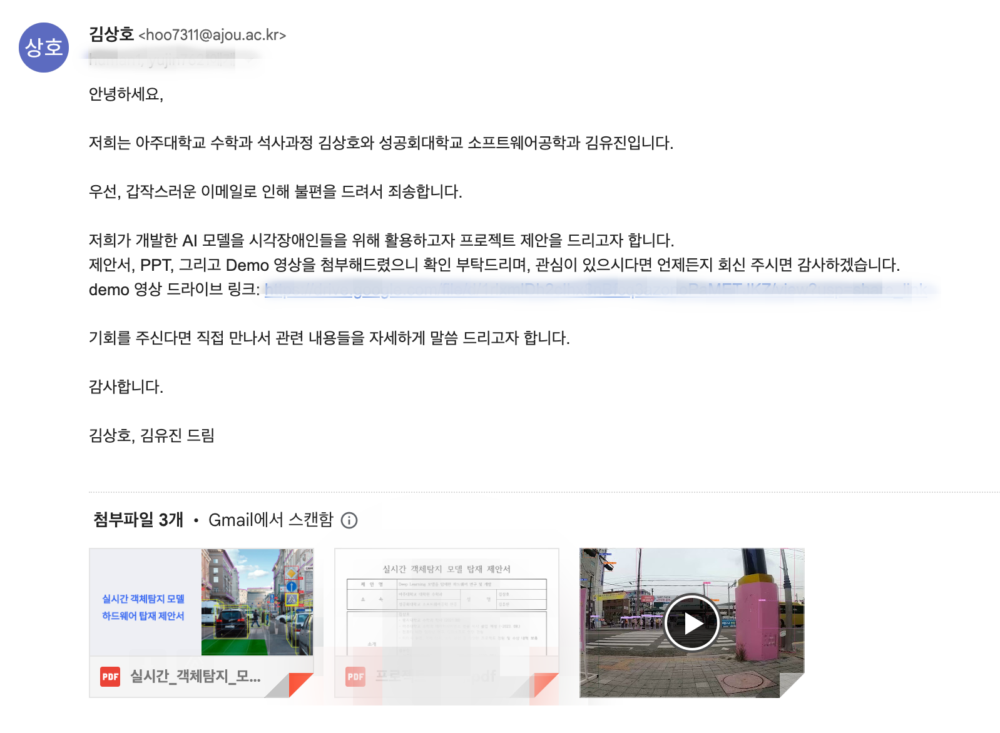

*Overview: 장애인 보조장치 개발 회사에게 Obstacle Detection 프로젝트 협업 요청*  

석사 학위 논문으로 시각 장애인을 위한 도로 위의 위험물 탐지 프로젝트를 했었다. 원래는 프로젝트 초기에 협업 요청을 시도하려고 했었다.
아 그리고 여기서 잠깐 왜 프로젝트 협업을 하려고 했는지 말을 하자면, 2022년 9월에 시각 장애인 협회에 방문해 여러 말씀을 들었는데 마지막에 하신 말씀이 있었다.
나처럼 자문을 구하러 온 사람은 많은데 정작 결과물을 들고 온 사람은 없었다라고 하신 것이 내게 큰 충격으로 남아 꼭 결과물을 들고 가고 싶었다.
아무튼 제안서 같은 서류들을 어떻게 작성하면 좋을지 지도교수님께 조언을 구하다가 아직 결과물이 나온 것이 없는데 회사에서 요청을 받아들일리 없다고 하셨다.
생각해보니 맞는 말씀이다. 기업은 이익을 추구하는 집단이다 보니 수익이 나지 않거나 확실한 결과물에 대한 신뢰가 없다면 내가 협업 요청을 한다고 해도 받아주지 않을 것 같았다.
결국 본격적으로 프로젝트를 수행하고 모델의 성능을 끌어올리기 위해 많은 논문을 읽어보고 적용해보고 학위 논문 작성도 거의 마무리를 할 때 쯤 다시 협업 요청을 시도했다.
내가 구축한 모델을 시각 장애인들을 위해 쓰이려면 어쨌든 임베디드 기기를 활용해야 할 것이다. 근데 임베디드 기기는 하드웨어 사양이 현저히 낮다.
그래서 iOS 개발자 친구에게 도움을 요청해 iOS 하드웨어로 내 모델을 탑재해 추론을 할 때 FPS와 정확도를 체크해달라고 했다.
정말 고마운 친구다 ㅜㅜ 내 부탁을 여러 번 들어주고 도움도 많이 준 친구다.
어찌저찌 친구에게 부탁한 내용은 마무리하고 이제 협업 요청을 위해서 서류를 작성했다.
근데 어떻게 작성을 해야 회사에서 내가 제안한 것을 흥미롭게 받아들일지 고민을 많이 했다. 정말 힘들었다. 어떻게 작성해야 하는지, 어떤 내용을 넣어야 하는지 고민을 많이 했다.
결국 회사를 다니는 친구에게 도움을 요청해 어떤 내용을 넣으면 좋을지 조언을 구했다.
그 결과 SWOT 분석을 해서 관련 내용을 넣으면 좋겠다는 의견을 포함해 많은 도움을 받았다.
고맙다 친구야 ㅜㅜ
어쨌든 우여곡절 끝에 데모 영상과 제안서 그리고 발표자료도 보냈다.
회사에서 내 제안을 받아들일지 모르겠지만 설령 실패를 한다 해도 나에겐 큰 자산으로 남을 것 같다.
