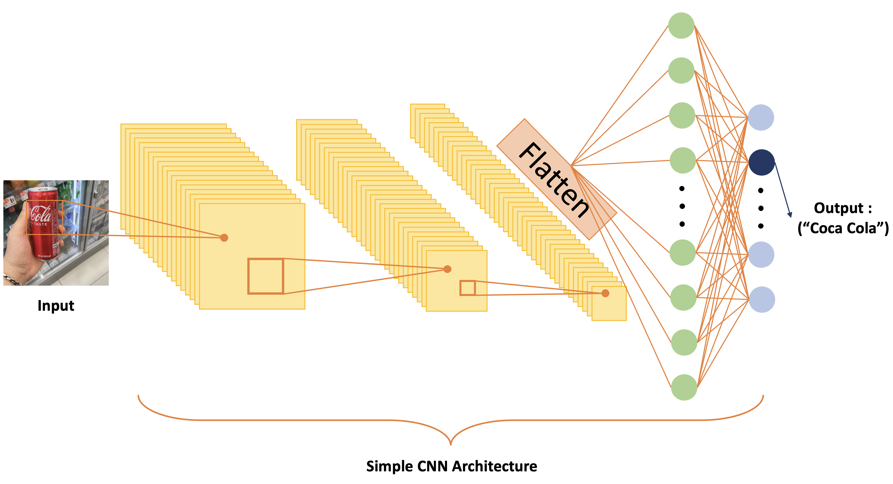

### 담당 역할  
- 음료수 이미지 데이터셋 수집 및 전처리
- 모바일 어플리케이션을 위한 분류 딥러닝 모델 구축
- 모델 학습 및 하이퍼파라미터 튜닝

### 성과
- Classification Accuracy 95%
- 구글 플레이스토어 및 애플 앱스토어 출시 예정

### 회고
- 데이터셋 수집
  - 이미지 데이터셋을 음료수마다 최소 8~10장씩 모아야 하는데 구글에 있는 이미지는 너무 올바르게 되어있었고 일상적인 배경의 음료수 이미지는 거의 없었다.
  - 또한 로고만 올바르게 보이는 것이 대부분이었으며 어떤 위치 또는 각도에서든 음료수를 정확히 분류해야 하는 나의 task에는 적합하지 않은 이미지가 대부분이었다.
  - 그래서 직접 사진을 찍기로 했는데 이때 이마트24 용인 명지대점, 하나로마트 오산농협본점에서 도움을 주셔서 수월하게 이미지 데이터를 수집할 수 있었다.

### 시기 및 사용 기술
- 진행 기간: 2023.05.15 ~ present
- 인원: FE (1), BE (1), DL (1)
- 사용 기술: PyTorch
- 모델: ShuffleNetV2, MobileNetV3, MNASNet, EfficientNetV2
