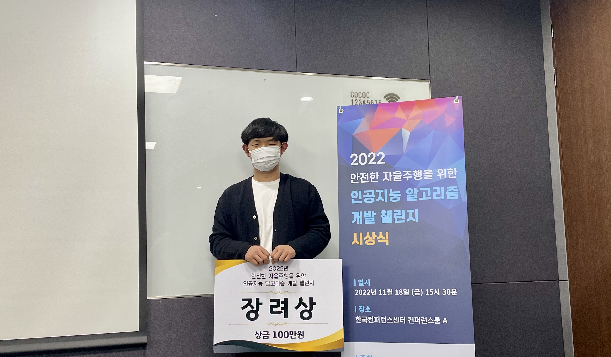

### 담당 역할  
- 이미지 데이터 시각화 분석 및 Label 전처리
- Real-time Semantic Segmentation 모델 구축
- 모델 학습 및 결과 분석, 하이퍼파라미터 튜닝

### 성과
- 장려상 수상
- Mean IoU 80%, Pixel Accuracy 85%

### 회고
- Problem 1. 오래 소요되는 학습 시간
  - polygon 형태의 label을 png format의 이미지로 변환해서 저장 후 학습 재시도
  - 학습 시간 50% 감소
  - 또한 이 과정에서 jpg format으로 저장하면 class index를 벗어나는 문제가 발생 (png format으로 저장!)

- Problem 2. Over-Fitting
  - 원인 분석 결과, parking place, potted line, road mark 등 다른 클래스와 특성이 겹치는 경우 발견
  - 불필요한 클래스는 Ignore index로 지정, 특성이 비슷한 클래스는 하나의 클래스로 묶어서 29개에서 15개 클래스로 줄여 재학습
  - Validation에서의 Mean IoU가 40%에서 45%로 증가

- Problem 3. 기대치보다 낮은 성능
  - 데이터셋 이미지를 살펴본 결과, 주간과 야간 이미지로 이루어져 이를 분리 후 재학습
  - 주간 이미지의 Mean IoU는 80%, 야간 이미지의 Mean IoU는 45%를 달성

### 시기 및 사용 기술
- 진행 기간: 2022.09.13 ~ 2022.11.13
- 인원: DL (3)
- 사용 기술: PyTorch
- 모델: BiSeNetV2, PIDNet
