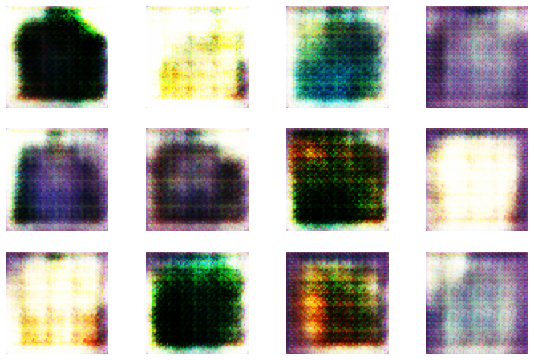
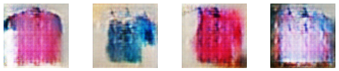
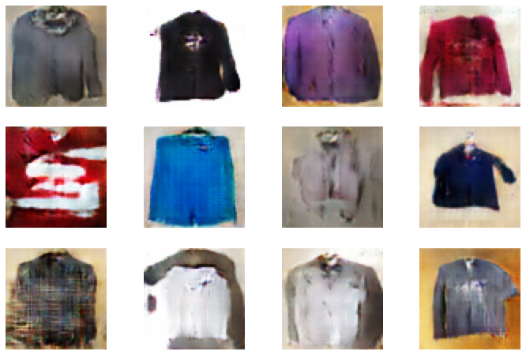

### 담당 역할  
- GAN 관련 논문 리뷰 및 구현
- 학습을 위한 이미지 데이터 수집
- 모델 학습 및 결과 분석

### 회고
- Generator와 Discriminator의 학습 순서 및 학습 비율에 따라 Generator의 성능에 영향을 끼침
- Discriminator의 loss function에 label smoothing을 설정하면 더 좋은 성능을 보이는 경향 존재
- AnoGAN을 이용해 치아 이미지 이상치 탐지 프로젝트에 적용을 한 결과, 좋지 않은 성능을 보였지만 GAN을 활용해 다양한 어플리케이션을 구상

### 시기 및 사용 기술
- 진행 기간: 2022.01.03 ~ 2022.02.28
- 인원: DL (1)
- 사용 기술: PyTorch, Tensorflow, Keras
- 모델: GAN, DCGAN, Pix2Pix, AnoGAN
