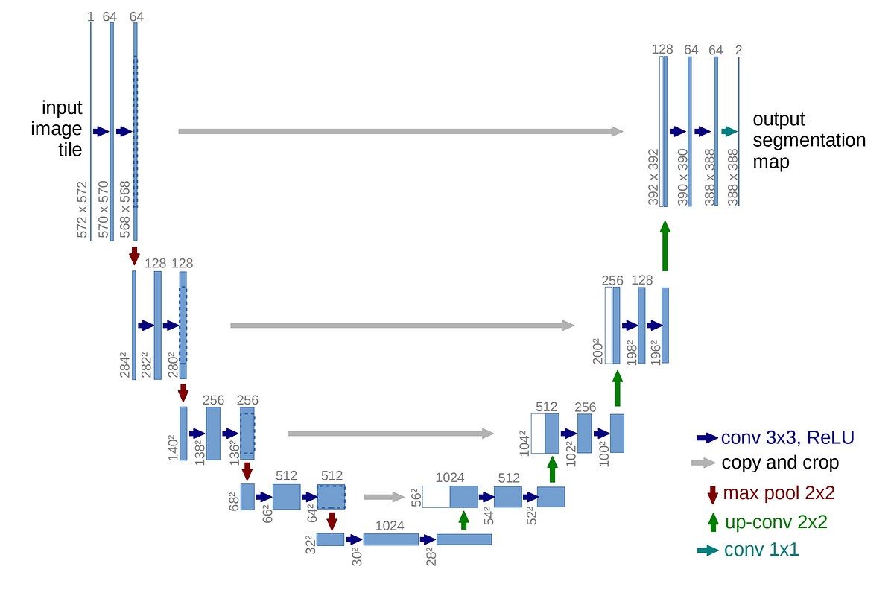

### 담당 역할  
- 이미지 시각화 분석 및 학습을 위한 Label format 변환
- 모델 학습 및 결과 분석, 하이퍼파라미터 튜닝

### 성과
- Mean IoU 95%, Pixel Accuracy 99%, Dice Score 95%

### 회고
- Problem 1. DCM format으로 이루어진 Label
  - label image의 format이 dcm으로 이루어져 정상적으로 Label Image를 파악할 수 없는 문제 발생
  - mritopng를 이용해 dcm format을 png format으로 변환

- Problem 2. 부족한 데이터 갯수
  - 제공 받은 학습 데이터 갯수는 총 100개, Training 80, Validating 20개로 분할
  - Data Augmentation을 이용해 데이터 부족으로 인한 문제점 해결
  - 이때 적용한 method는 Random Horizontal Flip, Random Rotate, Random Scale, Random Crop
  
- Problem 3. 낮은 성능
  - 다양한 Optimizer (SGD momentum, Adam, NAdam, RAdam, AdamW)로 실험
  - Learning Rate Scheduler 사용
  - Mean IoU 90%에서 92%로 개선

### 시기 및 사용 기술
- 진행 기간: 2022.11.21 ~ 2022.11.28
- 인원: DL (2)
- 사용 기술: PyTorch
- 모델: U-Net
