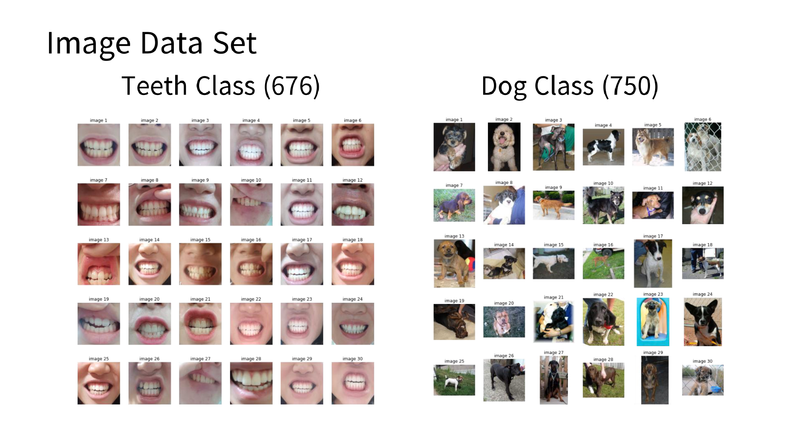

### 왜 일반적인 Classification task가 아닌 Anoamly Detection task인가?  
- 어플 내에서 일반적으로 유저들은 정상적인 치아 이미지를 업로드
- 그러나 흔하지 않은 경우로 치아 이미지가 아닌 다른 이미지가 업로드될 경우 이를 방지하기 위해 Anomaly Detection으로 접근

### 담당 역할  
- 이미지 데이터 정제 및 Labeling
- 머신러닝 파이프라인 설계 및 Isolation Forest 학습
- pre-trained VGG16, ResNet50로 학습
- 모델 학습 및 결과 분석, 하이퍼파라미터 튜닝

### 성과
- Anoamly Image Recall Score 100%
- Classification Accuracy 95%

### 회고
- Problem 1. 제각각인 치아 사진
  - 다양한 각도에서 찍힌 치아 사진 중 정면 각도에서 찍힌 것, 치아와 입술이 충분히 포함되는 이미지만 학습 데이터로 사용

- Problem 2. 하이퍼파라미터 튜닝에 너무 많은 시간 소요
  - Unsupervised Learning 방식인 Isolation Forest는 하이퍼파라미터 튜닝이 어렵다는 문제 발생
  - validation set을 따로 구축하고 labeling을 진행해 Scikit-Learn의 GridSearchCV와 비슷한 기능을 하는 알고리즘 개발
  - 그 결과 실험 시간이 단축

- Problem 3. 기준에 미치지 못하는 모델 성능
  - Isolation Forest 대신 CNN 모델 구축
  - AutoEncoder, Binary Classification CNN 등 구현
  - 이때 Classification CNN을 학습할 때 치아 데이터의 비율이 90% 넘게 차지하는 문제 존재
  - 치아 이미지는 Under sampling을 수행하고 그 외의 이미지 데이터(눈, 코, 강아지 등)를 Over sampling을 수행
  - 치아 이미지와 특정 클래스 이미지로 Binary Classification으로 학습을 시킨 후 두 클래스에 해당되지 않는 이미지를 넣으면 score가 0.3 ~ 0.7로 애매한 값을 가질 것이라 가설 수립
  - 그 후 치아 이미지에 대한 Threshold를 0.9로 높게 설정해 치아 외의 이미지는 분류하도록 설계
  - 그 결과 Recall Score 100% 달성

### 시기 및 사용 기술
- 진행 기간: 2021.09.01 ~ 2022.12.31
- 인원: ML (3)
- 사용 기술: Tensorflow, Keras, OpenCV, Scikit-Learn
- 모델: VGG16, ResNet50, AutoEncoder, Customized CNN
